# migration-tools

## 介绍

本文主要介绍服务器迁移软件(以下简称“migration-tools”）的使用方法，帮助用户顺利从原系统(centos7、centos8)迁移到统信服务器操作系统。
migration-tools工具提供网页界面方式进行操作，以供使用者在图形化界面便捷的进行迁移操作。

### 部署方式

在安装openeuler 23.09服务器上部署服务端(server)，在需要迁移的 centos7 / centos8服务器上部署客户端(agent)

#### 支持迁移的系统

1.支持将AMD64和ARM64架构的CentOS系列系统迁移到UOS系统，迁移前需自行准备目标系统的全量源。
2.openeuler迁移：目前仅支持centos 7.4 cui系统迁移至openeuler 20.03-LTS-SP1
3.不建议对安装了i686架构的rpm包的原系统进行迁移，如果对这种原系统进行迁移会出现迁移失败的结果。

|原系统|目标系统|使用的软件源|
|---|---|---|
|centos 7.4 cui|openeuler 20.03-LTS-SP1|使用openeuler外网源|
|centos 7.0~7.7|UOS 1002a|UOS 1002a（全量源）|
|centos 8.0~8.2|UOS 1050a|UOS 1050a（全量源）|

### 使用方法

#### 配置与安装

##### migration-tools-server端

- 关闭防火墙

``` shell
systemctl stop firewalld
```

- 安装migration-tools-server

``` shell
yum install migration-tools-server -y
```

- 修改配置文件

``` shell
vim /etc/migration-tools/migration-tools.conf
```

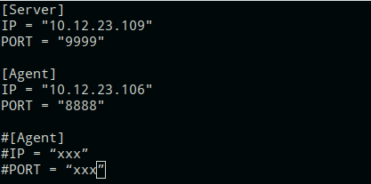

- 重启migration-tools-server服务

``` shell
systemctl restart migration-tools-server
```

- 分发agent软件包

- 根据迁移系统的版本选择分发的软件包
- centos7系列：
xx.xx.xx.xx表示迁移机器IP

``` shell
scp -r /usr/lib/migration-tools-server/agent-rpm/el7 root@xx.xx.xx.xx:/root
```

- centos8系列：

``` shell
scp -r /usr/lib/migration-tools-server/agent-rpm/el8 root@xx.xx.xx.xx:/root
```

#### 迁移openeuler系统

>**注意:** openeuler系统可选使用脚本迁移或在用户权限检测界面的目标系统标签，选择euler后点击下一步即可

- 从server端分发迁移脚本至agent端

``` shell
cd /usr/lib/migration-tools-server/ut-Migration-tools-0.1/centos7/
scp openeuler/centos72openeuler.py root@10.12.23.106:/root
```

- 安装迁移所需依赖

``` shell
yum install python3 dnf rsync yum-utils -y
```

- 开始迁移

``` shell
python3 centos7/openeuler/centos72openeuler.py
```

- 迁移完成后系统会自动重启，重启完成后即迁移完成
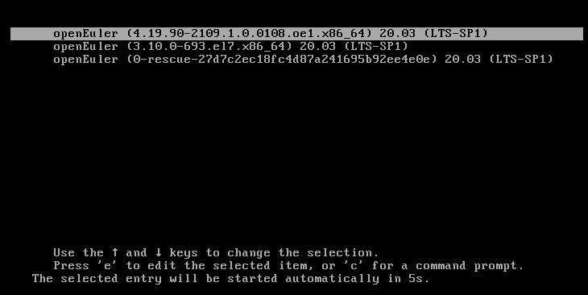

#### 迁移UOS系统

##### 安装migration-tools-agent端

在准备迁移的centos机器上执行以下步骤
>**注意:** 目前migration-tools仅支持centos7.4 cui迁移至openeuler 20.03-LTS-SP1

- 关闭防火墙

``` shell
systemctl stop firewalld
```

- 安装epel-release（部分依赖包含在epel源中）

``` shell
yum install epel-release -y
```

- 安装migration-tools-agent软件包（centos7系列需安装对应架构的软件包）

- centos7:

``` shell
cd /root/el7/x86_64
yum install ./* -y
```

- centos8

``` shell
cd /root/el8/
yum install ./* -y
```

- 修改配置文件

``` shell
vim /etc/migration-tools/migration-tools.conf
```


- 重启migration-tools-agent服务

``` shell
systemctl restart migration-tools-agent
```

##### UOS系统迁移步骤

- 登录web端
在server端和agent端服务均启动后，打开浏览器（建议使用：Chrome），在浏览器导航栏中输入`https://SERVER_IP:9999`即可。
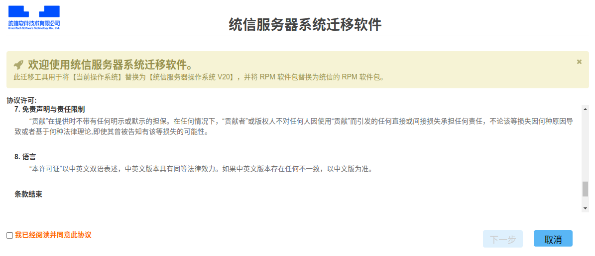

- 点击“我已阅读并同意此协议”，然后点击下一步
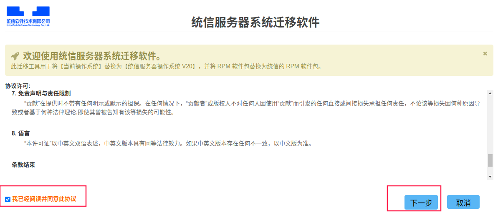

- 迁移提示页面内容如下，点击下一步
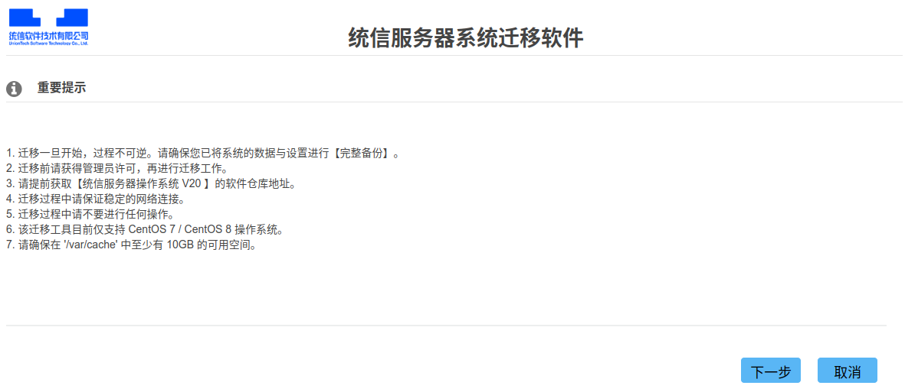

- 环境检测页面会检查系统版本和系统剩余空间大小，在检测完成后点击下一步

>**注意:** 如果出现检测长时间无反应，请检查agent防火墙是否关闭，server与agent服务是否开启。
> 如需重新检测，在浏览器中刷新即可。

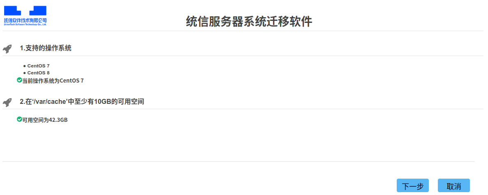

- 用户检测页面会检查用户名以及密码，推荐使用root用户，默认为迁移uos，如想迁移euler，目标系统选择euler即可，点击下一步开始检测，检测完成后自动进入repo源配置页面，如果目标系统选择euler，点击下一步直接进入迁移环节。
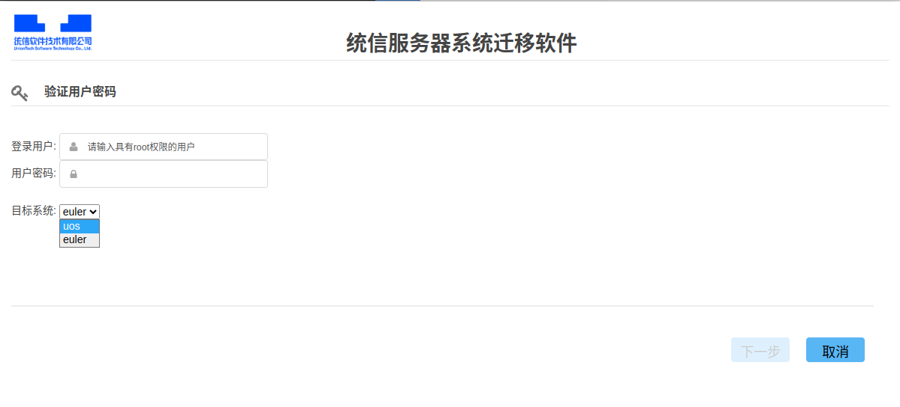

repo源配置页面

- 请根据要迁移的系统输入对应的repo源
   centos7:1002a，centos8:1050a

- 确保使用的软件源为全量源，否则迁移会失败

- 输入栏中只需输入1个软件仓库路径即可
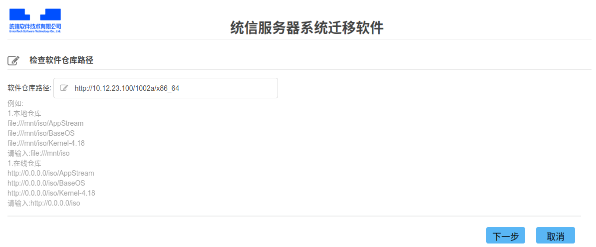

- 输入完成后点击下一步，等待软件源连通性检测完毕后，进入kernel版本选择页面，选择4.19内核，点击下一步
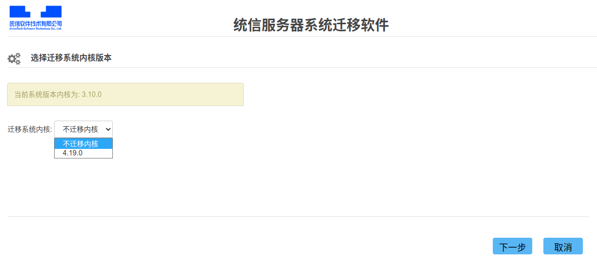

- 迁移环境检查界面可以对比迁移前后的软件包差异，并输出检测报告，检查完成后可以导出检测报告，

> **注意：** 检测时间大约为1个小时，请耐心等待

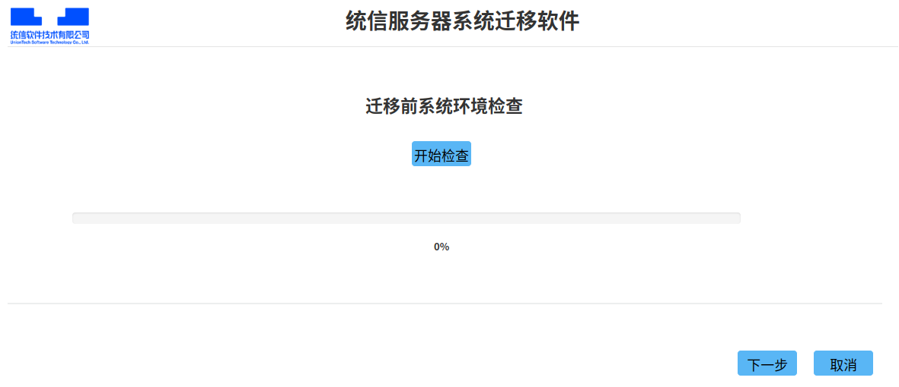

- 检测完成后，点击下一步会弹出系统迁移确认窗口，请确保系统已做好备份，准备完成后点击确认开始系统迁移
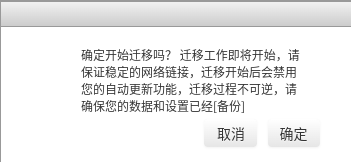

- 点击确认后，进入系统迁移页面


- 可以点击查看详情，来查看迁移情况
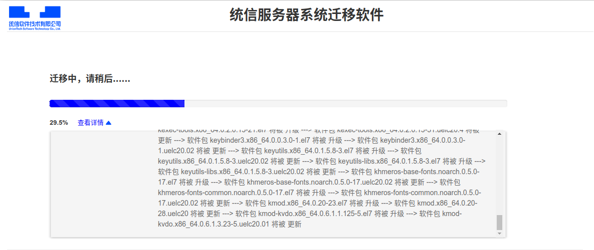

- 迁移完成后，页面会跳转至迁移完成页面，可在该页面导出迁移后检测报告及迁移日志。
- 导出后，可在server端/var/tmp/uos-migration/目录下找到报告和日志的压缩包，解压后即可查看
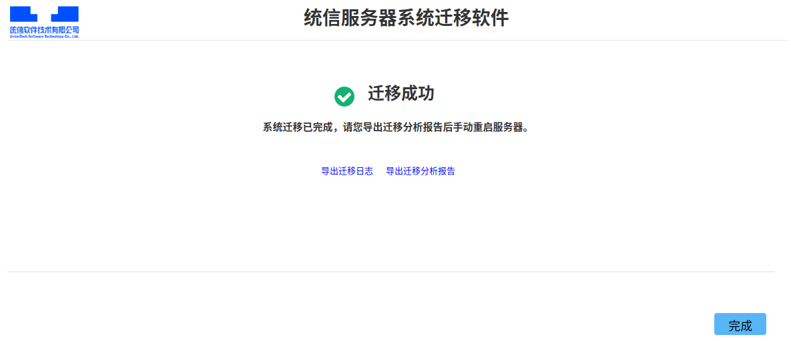

- 迁移完成后，需手动重启agent机器，并验证是否迁移完成

###### 验证步骤

1. 执行以下命令，检查操作系统版本是否已升级至目标操作系统。

``` shell
uosinfo
```

如显示以下信息表示升级成功
1002a:
``` shell
#################################################
Release:  UnionTech OS Server release 20 (kongli)
Kernel :  4.19.0-91.77.97.uelc20.x86_64
Build  :  UnionTech OS Server 20 1002c 20211228 x86_64
#################################################
```

1050a:
``` shell
#################################################
Release:  UnionTech OS Server release 20 (kongzi)
Kernel :  4.19.0-91.82.88.uelc20.x86_64
Build  :  UnionTech OS Server 20 1050a 20220214 x86_64
#################################################
```
