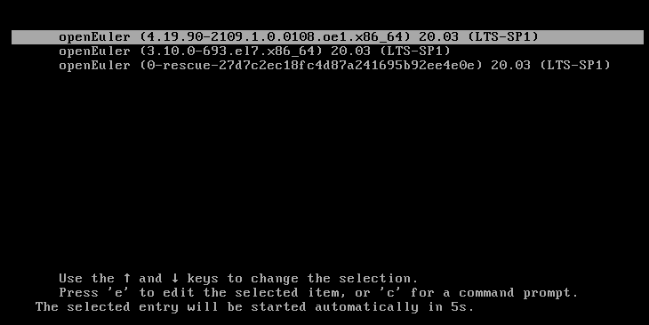

# migration-tools

## 介绍

本文主要介绍服务器迁移软件(以下简称“migration-tools”）的使用方法，帮助用户顺利从原系统(centos7、centos8)迁移到OpenEuler操作系统和统信服务器操作系统。
migration-tools工具提供网页界面方式进行操作，以供使用者在图形化界面便捷的进行迁移操作。

### 部署方式

在安装openeuler 23.09服务器或centos7，在需要迁移的 centos7 / centos8服务器上部署客户端(agent)

#### 支持迁移的系统

1.支持将AMD64和ARM64架构的CentOS系列系统迁移到UOS系统，迁移前需自行准备目标系统的全量源。
2.openeuler迁移：目前仅支持centos 7.4 cui系统迁移至openeuler 20.03-LTS-SP1
3.不建议对安装了i686架构的rpm包的原系统进行迁移，如果对这种原系统进行迁移会出现迁移失败的结果。

|原系统|目标系统|使用的软件源|
|---|---|---|
|centos 7.4 cui|openeuler 20.03-LTS-SP1|使用openeuler外网源|


### 使用方法

#### 安装与配置

##### 安装migration-tools-server端

- 关闭防火墙

``` shell
systemctl stop firewalld
```

- 安装migration-tools-server

``` shell
yum install migration-tools-server -y
```


- 配置sshd

``` shell
# 配置/etc/ssh/sshd_config
UseDNS no
GSSAPIAuthentication no

# 配置/etc/ssh/ssh_config
StrictHostKeyChecking no
```

- 关闭防火墙
```systemctl stop firewalld.service```

- 修改配置文件

```commandline
[root@localhost migration-tools]# cat /etc/migration-tools/migration-tools.conf 
[Server]
IP = "10.12.23.93"
PORT = "9999"
DB_NAME = "uossysmig"
DB_PASSWORD = "UYi2023.."
DB_USER = "root"

[Agent]
ID = 0
IP = "10.12.23.94"
PORT = "8888"
BASEURL = ""
TYPE = local
```

- uyi7.repo或uyi8.repo
```commandline
# 迁移cnetos7系统配置uyi7.repo，迁移centos8则配置uyi8.repo，包含centos7/8和迁移软件的本地源，这里需要配置一个可用于装包的软件源。以及编译好的agent软件包的源。
[root@localhost migration-tools]# cat /etc/migration-tools/uyi7.repo 
[uyi0]
name=uyi0
baseurl=http://10.12.23.60/repo/1002/$basearch/OS
gpgcheck=0
enabled=1

[uyi1]
name=uyi1
baseurl=http://10.12.23.93/uyi/7
gpgcheck=0
enabled=1
```


- 配置mysql数据库
```commandline
systemctl start mysqld.service
grep "password" /var/log/mysqld.log
mysql -uroot -p
# 进入数据库
ALTER USER 'root'@'localhost' IDENTIFIED BY 'UYi2023..';
create database uossysmig;
use uossysmig;
source /usr/lib/migration-tools-server/migration-tools.sql
use mysql;
update user set host='%' where user = 'root';
flush privileges;
exit;
# 退出数据库
systemctl restart mysqld.service
```

- 修改配置文件

``` shell
vim /etc/migration-tools/migration-tools.conf
```

- 重启migration-tools-server服务

``` shell
systemctl restart migration-tools-server
查看服务是否正常。centos7低版本需要单独安装atlas后可正常启动。
```

- 编写Agent端的信息

```commandline
# 修改配置文件，如增加10.12.23.94主机迁移
[root@localhost migration-tools]# cat /etc/migration-tools/migration-tools.conf 
[Server]
IP = "10.12.23.93"
PORT = "9999"
DB_NAME = "uossysmig"
DB_PASSWORD = "UYi2023.."
DB_USER = "root"

[Agent]
ID = 0
IP = "10.12.23.94"
PORT = "8888"
BASEURL = ""
TYPE = local
```

#### 迁移openeuler系统

>**注意:** openeuler系统使用的是脚本默认的源

- 导入

- 选择需要迁移的系统

- 筛选可用空间不足的主机

- 开始迁移

- 迁移完成后系统会自动重启，重启完成后即迁移完成


#### 迁移UOS系统

- 导入

- 选择需要迁移的系统

- 筛选可用空间不足的主机

- 修改配置文件

``` shell
vim /etc/yum.repos.d/openeuler.repo
```
- 开始迁移
#### 验证步骤

1. UOS系统执行以下命令，检查操作系统版本是否已升级至目标操作系统。

``` shell
uosinfo
```

如显示以下信息表示升级成功
1002a:
``` shell
#################################################
Release:  UnionTech OS Server release 20 (kongli)
Kernel :  4.19.0-91.77.97.uelc20.x86_64
Build  :  UnionTech OS Server 20 1002c 20211228 x86_64
#################################################
```

1050a:
``` shell
#################################################
Release:  UnionTech OS Server release 20 (kongzi)
Kernel :  4.19.0-91.82.88.uelc20.x86_64
Build  :  UnionTech OS Server 20 1050a 20220214 x86_64
#################################################
```
2. openEuler系统执行以下命令，检查操作系统版本是否已升级至目标操作系统。

```shell
cat /etc/os-release
 
NAME="openEuler"
VERSION="20.03 (LTS-SP1)"
ID="openEuler"
VERSION_ID="20.03"
PRETTY_NAME="openEuler 20.03 (LTS-SP1)"
ANSI_COLOR="0;31"
```